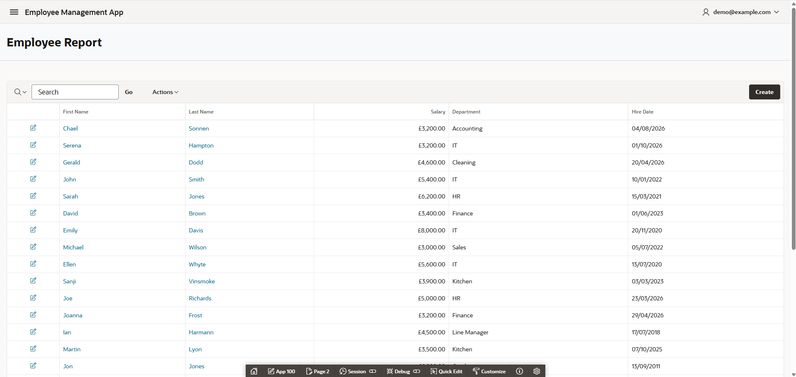
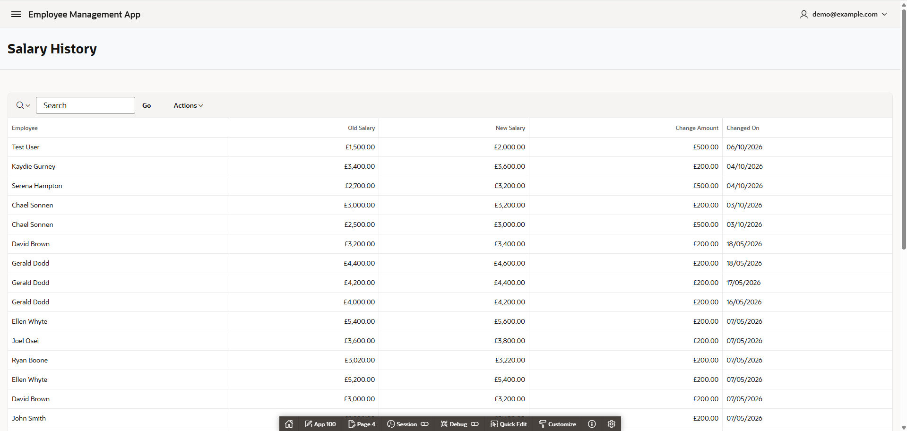
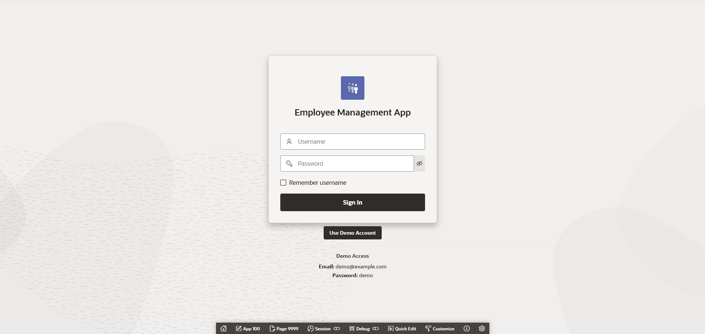

# Employee Salary Management System

An Oracle APEX employee management application built to demonstrate practical APEX, SQL, and PL/SQL development skills.

The application manages employee records, applies controlled salary updates, maintains a salary audit history, and provides interactive workforce analytics through reports, KPI cards, and charts.

---

## Live Demo

**Oracle APEX Application:**  
https://gca2c3439af01cb-myappdb.adb.uk-london-1.oraclecloudapps.com/ords/r/myapp_ws/employee-management-app/home

### Demo Access

A recruiter/demo account is available from the login page using the **Use Demo Account** option.

The demo account can explore the application, create and edit employees, test salary updates, view salary history, and interact with the dashboard.

---

## Project Overview

The Employee Salary Management System simulates an internal HR application for maintaining employee and salary information.

The project demonstrates more than standard CRUD functionality. Business rules are implemented using packaged PL/SQL, salary changes are automatically audited through a database trigger, application errors can be recorded through a reusable logging procedure, and database constraints protect historical salary records.

### Key Features

- Create and edit employee records
- Controlled salary updates using PL/SQL business logic
- Automatic salary-change auditing
- Salary and hire-date validation
- Prevention of unrealistic future hire dates
- Protection of salary-history records through referential integrity
- User-friendly handling of restricted employee deletion
- Interactive employee reports
- Salary-history reporting
- Employee-level salary KPIs
- Workforce analytics dashboard
- Department-based dashboard filtering
- Custom authentication
- Role-based authorization logic
- Reusable PL/SQL error logging
- Responsive Oracle APEX interface

---

## Business Logic and PL/SQL

### Employee Package

Employee business logic is encapsulated in `EMP_PKG`.

The package contains:

- `UPDATE_EMPLOYEE_SALARY`
- `VALIDATE_SALARY`
- `VALIDATE_HIRE_DATE`

### Controlled Salary Updates

Existing employee salaries cannot be manually edited through the Employee Form.

Salary changes must instead use the **Update Salary** action, which calls:

```sql
EMP_PKG.UPDATE_EMPLOYEE_SALARY
```

The current business rule is:

```text
Salary below £3,000  → Increase by £500
Salary £3,000+       → Increase by £200
```

This keeps salary changes controlled through the PL/SQL business layer rather than allowing users to bypass the rule through direct form editing.

### Salary Validation

`VALIDATE_SALARY` prevents missing or negative salary values.

### Hire Date Validation

`VALIDATE_HIRE_DATE` allows future starters while preventing unrealistic future hire dates.

A hire date can be:

- Blank
- In the past
- Today
- Up to 12 months in the future

Dates more than 12 months in the future are rejected.

---

## Salary Audit Trail

Salary changes are automatically recorded using the `TRG_SALARY_HISTORY` database trigger.

When an employee's salary changes, the trigger stores:

- Employee ID
- Previous salary
- New salary
- Date of change

The Salary History report then calculates and displays the change amount.

```text
Update Salary
      ↓
EMP_PKG.UPDATE_EMPLOYEE_SALARY
      ↓
EMPLOYEES.SALARY updated
      ↓
TRG_SALARY_HISTORY
      ↓
SALARY_HISTORY audit record
      ↓
Salary History / Analytics
```

Employees with existing salary-history records cannot be deleted. A foreign key protects the historical data, while an APEX validation provides a user-friendly message instead of exposing the underlying Oracle constraint error.

---

## Error Logging

A reusable `LOG_ERROR` procedure records unexpected PL/SQL errors in the `ERROR_LOG` table.

Captured information includes:

- Oracle error code
- Error message
- Application module
- Application user
- Error date

The procedure uses an autonomous transaction so an error record can be preserved independently when the calling transaction fails.

---

## Database Design

The application uses four main tables.

### `EMPLOYEES`

Stores employee details including:

- Employee ID
- First name
- Last name
- Salary
- Department
- Hire date

A database check constraint prevents negative salary values.

### `SALARY_HISTORY`

Stores the salary audit trail and references `EMPLOYEES` through a foreign key.

### `APP_USERS`

Stores accounts used by the custom APEX authentication scheme, including application roles.

### `ERROR_LOG`

Stores errors captured by the PL/SQL logging procedure.

The database creation scripts are available in the [`database`](database/) directory.

---

## Authentication and Authorization

The application uses a custom Oracle APEX authentication scheme backed by `APP_USERS`.

An authorization scheme also checks application roles to identify administrative users.

Public registration is intentionally not enabled. A dedicated demo account is provided for portfolio review.

> **Security note:** The custom authentication implementation uses SHA-256 hashing and was created for demonstration and learning purposes. It should not be considered a production-grade password-storage implementation. A production system should use an appropriate password-specific authentication and hashing mechanism.

---

## Dashboard and Analytics

The dashboard provides an overview of workforce salary data.

It includes:

- Total Employees
- Average Monthly Salary
- Total Monthly Payroll
- Average Monthly Salary by Department
- Top 5 Salary Increases
- Number of Salary Changes
- Department filtering

Dynamic Actions refresh the dashboard when the department filter changes.

---

## Technologies Used

| Technology | Purpose |
|---|---|
| Oracle APEX 26ai | Application development |
| Oracle Database | Data storage and integrity |
| Oracle SQL | Queries and analytics |
| PL/SQL | Business logic and validation |
| APEX Interactive Reports | Employee and salary-history reporting |
| APEX Charts | Workforce analytics |
| Dynamic Actions | Interactive dashboard behaviour |
| Redwood Light | Application theme |
| Git / GitHub | Source control and project presentation |

---

## Screenshots

### Landing Page


### Dashboard


### Employee Report



### Employee Form


### Salary History



### Login and Demo Access



---

## Repository Structure

```text
Employee-Management-App/
├── apex/
│   └── f100.sql
│
├── database/
│   ├── tables.sql
│   ├── log_error.sql
│   ├── emp_pkg.sql
│   └── trg_salary_history.sql
│
├── Screenshots/
│   ├── landing-page.png
│   ├── dashboard.png
│   ├── employee-report.png
│   ├── employee-form.png
│   ├── salary-history.png
│   └── login.png
│
└── README.md
```

---

## Installation

### 1. Create the database objects

Run the SQL scripts in the following order:

```text
1. database/tables.sql
2. database/log_error.sql
3. database/emp_pkg.sql
4. database/trg_salary_history.sql
```

### 2. Import the APEX application

Import:

```text
apex/f100.sql
```

into an Oracle APEX workspace.

### 3. Configure the application

Review the imported authentication scheme and application settings for the target environment before running the application.

---

## What I Learned

Building this project strengthened my understanding of:

- Oracle APEX application development
- SQL and relational database design
- PL/SQL packages and reusable business logic
- Functions and procedures
- Database triggers
- Exception handling and error logging
- APEX validations
- Authentication and authorization
- Referential integrity
- Interactive Reports
- APEX charts and KPI design
- Dynamic Actions
- Responsive APEX application design
- Separating UI behaviour from database business logic

---

## Author

**Joel Osei**

GitHub: https://github.com/Oseij96

This project was built as part of my Oracle APEX development portfolio to demonstrate practical SQL, PL/SQL, database, and business application development skills.