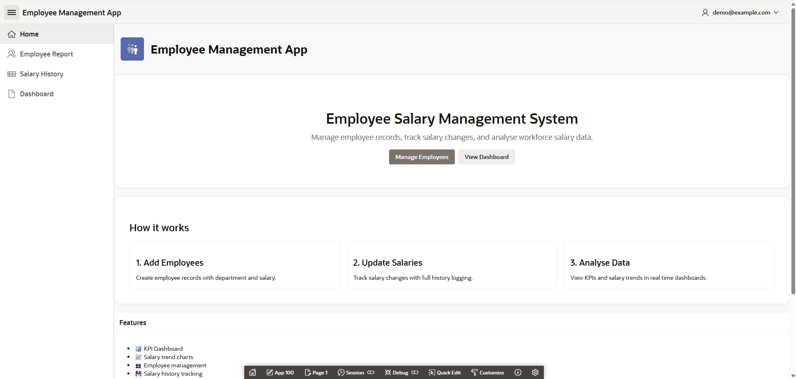
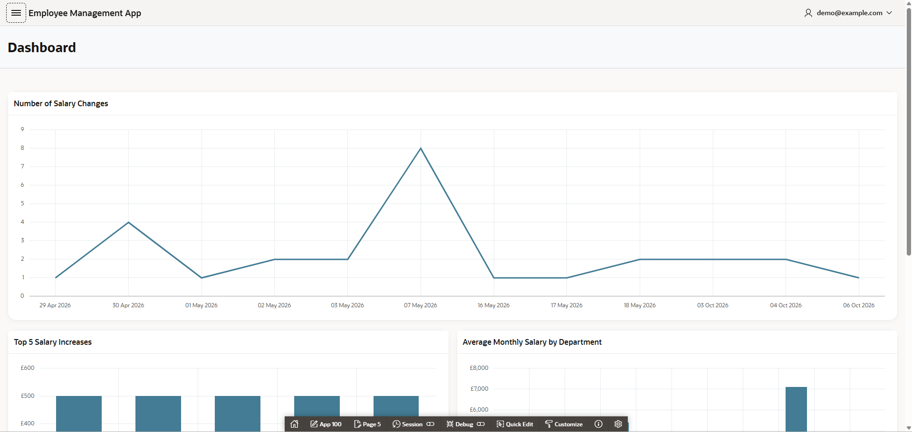
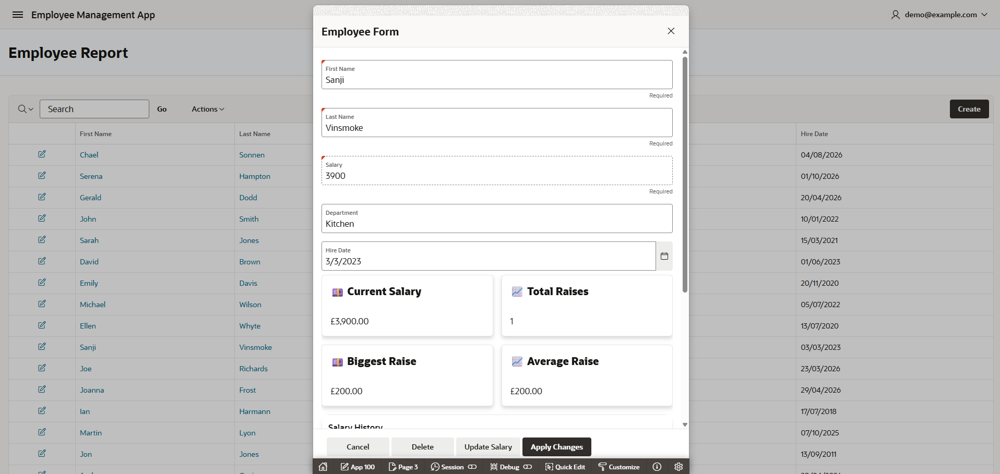
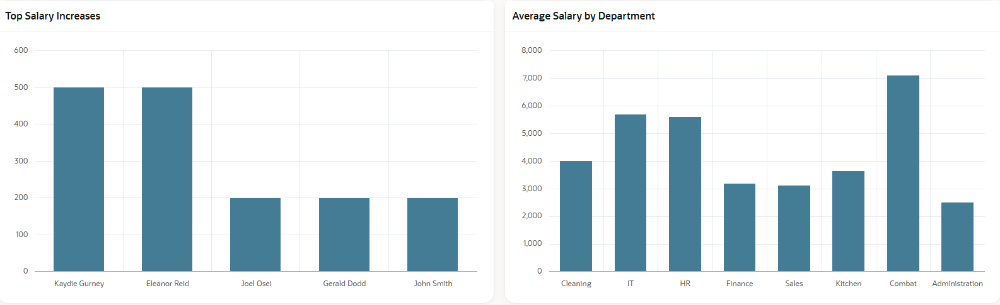
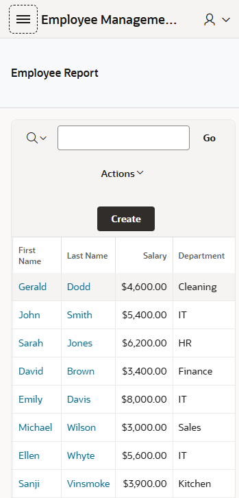
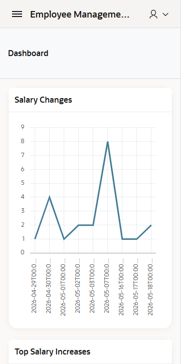

# Employee Salary Management System

A modern employee salary management and analytics application built with Oracle APEX, SQL, and PL/SQL.

This application allows users to manage employees, track salary changes over time, and analyse workforce salary data through interactive dashboards and charts.

---

## Live Demo

Oracle APEX Hosted Application:

https://gca2c3439af01cb-myappdb.adb.uk-london-1.oraclecloudapps.com/ords/r/myapp_ws/employee-management-app/home

## Overview

The goal of this project was to build a responsive business application that demonstrates:

- Oracle APEX development
- SQL and PL/SQL skills
- Dashboard and analytics design
- Interactive UI functionality
- Real-world CRUD operations
- Salary history tracking and reporting

The application was designed to simulate an internal HR salary management platform.

---

# Features

## Employee Management
- Add new employees
- Edit employee records
- Delete employees
- Department organisation
- Responsive employee forms

## Salary History Tracking
- Track salary updates over time
- Store historical salary changes
- Visualise employee salary progression
- Analyse salary growth trends

## Interactive Dashboard
- KPI summary cards
- Average salary analytics
- Top salary increase charts
- Department filtering
- Real-time chart refresh using Dynamic Actions

## Data Visualisation
- Bar charts
- Line charts
- Salary trend visualisation
- Interactive filtering

## Responsive Design
- Mobile responsive layout improvements
- Optimised forms for smaller screens

## Authentication
- Secure login system
- Password hashing using SHA256
- Registration workflow
- Session-based authentication
---

# Technologies Used

| Technology | Purpose |
|---|---|
| Oracle APEX | Frontend application framework |
| Oracle SQL | Database queries |
| PL/SQL | Backend logic |
| Dynamic Actions | Interactive UI behaviour |
| Interactive Charts | Analytics visualisation |
| Redwood Light Theme | UI styling |

---

# Application Architecture

## Frontend
The frontend was built using Oracle APEX components including:

- Cards Regions
- Charts
- Forms
- Navigation Components
- Dynamic Actions

## Backend
The backend uses Oracle Database with SQL and PL/SQL for:

- Data storage
- Salary tracking
- Aggregation queries
- Filtering logic
- Custom authentication implementation

---

# Database Schema

## Employees Table

| Column | Type |
|---|---|
| employee_id | NUMBER |
| first_name | VARCHAR2 |
| last_name | VARCHAR2 |
| department | VARCHAR2 |
| salary | NUMBER |

---

## Salary History Table

| Column | Type |
|---|---|
| history_id | NUMBER |
| employee_id | NUMBER |
| old_salary | NUMBER |
| new_salary | NUMBER |
| change_date | DATE |

---

# Dashboard Features

The analytics dashboard includes:

- Total Employees KPI
- Average Salary KPI
- Total Payroll KPI
- Average Salary by Department
- Top Salary Increases
- Employee Salary History Chart
- Department Filtering

---

# Screenshots

## Landing Page



---

## Dashboard



---

## Employee Form



---

## Salary Analytics



---

## Report Page On Smaller Screens



---

## Dashboard On Smaller Screens


---

# Lessons Learned

During this project I improved my understanding of:

- Oracle APEX development
- PL/SQL integration
- Interactive dashboards
- SQL aggregation queries
- Dynamic Actions
- UI/UX design within APEX
- Business application architecture

---

# Future Improvements

Planned improvements include:

- Public authentication system
- Gmail/email-based login
- Role-based permissions
- CSV/PDF export
- Employee profile images
- Audit logging
- Advanced analytics dashboard

---

# Installation / Setup

1. Import the Oracle APEX application export file
2. Create the required database tables
3. Run the SQL scripts
4. Configure authentication
5. Launch the application

---

# Author

Joel Osei

GitHub:
https://github.com/Oseij96
```
This project was built as part of my portfolio to strengthen my Oracle APEX, SQL, and PL/SQL development skills while simulating a real-world business application.